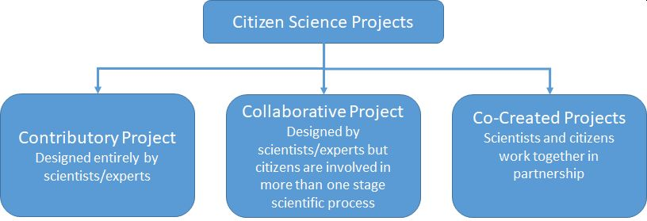
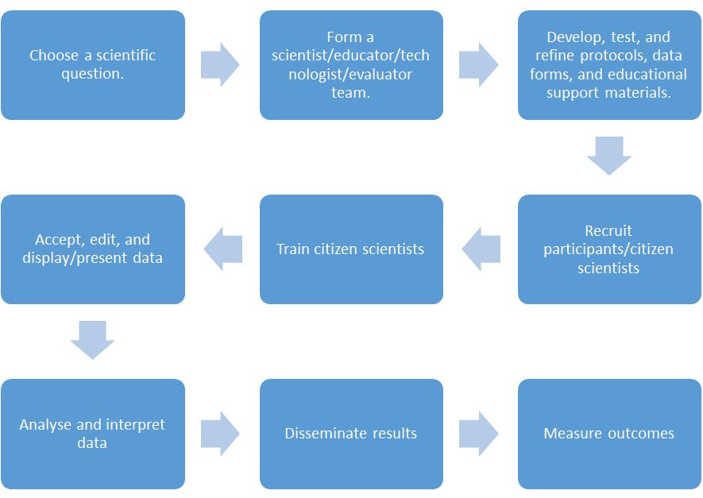

# Annotation  and  control  for  Citizen  Science  in‐situ data collection 

## Guidelines  

There are no international binding standards for collecting data using citizen science. Nevertheless, a large number of guidelines and best practice strategies exist The  European  Citizen  Science  Association  compiled  an  overview  of  such  Citizen Science guidelines and publications with links to the documents:  
  <a href="https://ecsa.citizen‐science.net/blog/collection‐citizen‐science‐guidelines‐and‐publications" title="Title">https://ecsa.citizen‐science.net/blog/collection‐citizen‐science‐guidelines‐and‐publications</a>
  
  

The general layout of a citizen science project can be classified into three categories:
  
  
  

###### Fig. 1: Model	for	developing,	execution	and	evaluation	of	citizen	science	projects (after	Bonney	et	al.	(2009a))	

One  the  one  side,  there  are  solely  contributory  projects,  which  are  planned  and designed  by  scientists  without  involving  citizen  scientists.  Here,  citizens  are  less involved and is more focused on the scientists needs. Many authors emphasize the importance  of  enthusiasm  among  citizen  scientists  for  the  subject,  which  helps  to capture the imagination of a broad audience. This will be difficult, with contributory projects. Projects that may gain more attention in the public and attract a committed team  of  citizen  scientists  are  collaborative  and  co‐created  projects.  Collaborative projects  are  also  initiated  and  designed  by  scientist  but  involve  citizens  in  several stages of the project design, execution, analysis and dissemination. Co‐created projects merge from an interested community of non‐experts, which is approach science with a task or question that could be resolved in a joint effort (Bonney et al. 2009b, Tweddle et al. 2012).
 

For  the  designing,  set‐up,  execution  and  analysis  of  the  results  of  citizen  science projects,  a  number  of  general  steps  is  recommended  in  many  publications.  The following summary has been compiled by (Bonney et al. 2009b) and shall serve as an example:

  

###### Fig. 2: Model for citizen science projects (after Bonney et al. (2009b))

## Annotation and control 

An annotation is a meta‐datum or data about data. It is permanently attached to other data, e.g. in‐situ measurement data. These annotations can be keywords or phrases. Annotations are not just additional information. They are linked to a specific item or datum in a data set. When a specific datum is separated from the whole data set, the annotation will still be attached to the datum. Annotations can help to classify data or to compare them. They can some basic information so that there is no need to touch a large data set itself. Annotations may be added manually by a human operator or interpreter or they can be added automatically. Manual annotation, depending on the experience of the interpreter, can be very precise but it is labor‐intensive and time‐consuming (and therefore costly). Automatic annotation may be less precise than manual annotation but it can be applied to large volumes of data in rather short periods. Manual annotation can be used to train algorithms for later automated annotation (Petrillo and Baycroft 2010).
 

Automated annotation emerged in the biological sciences in DNA/genome sequencing, where large data sets require annotation in short periods of time (Stein 2001, Yandell and Ence 2012). Other applications in the life sciences are mapping and monitoring of coral reefs or the benthic zone (Beijbom et al. 2012, Beijbom et al. 2016). 
With the advent of more spatial high‐resolution satellite imagery in the age of “remote sensing big data in recent years, it has become a challenging task to characterize the ever more complex and often ambiguous image contents in an efficient way. Remote sensing faces the same challenges as the aforementioned DNA annotation tasks. Human manual interpretation of satellite images may yield very precise information but it requires considerable expert knowledge, is time‐consuming and costly. Handling of large volumes of data in such a way is not efficient. To address this issue, automated annotation of digital satellite imagery can be applied, which is the process of assigning metadata in the form of keywords to the contents of an image. Methods for automated annotation are usually based on object oriented image classification, machine learning and neural networks (Luo et al. 2012, Neagoe and Stoica 2014, Xia et al. 2015, Yao et al. 2016).

Automated annotation in the process of in‐situ data collection campaigns is a preferable feature to meet the possible lack of consistency and objectivity in human description or labeling of the observed natural phenomena. Often experts (scientific community, administration, decision‐makers) also do not trust the quality of data that were collected by non‐experts in citizen science projects (Cohn 2008, Conrad and Hilchey 2011).

There are several possibilities for quality assurance and control in citizen science projects, already before any data acquisition takes place. This starts with the appropriate design of data base interfaces, web portals or mobile applications for data acquisitions, which only allow entry of data in a meaningful data range and format. Furthermore, work steps in the form of a protocol can be compiled to guide the data collectors during the data collection process. To support the data acquisition, the citizen scientists can be provided with additional expert information (e.g. image catalogue of the [natural] phenomena of interest, identification keys). Training of citizen scientists by experts is another important component of quality assurance. A subsequent verification at (randomly) selected locations by experts is a possibility to check the data quality after the data acquisition. This may not always be possible, especially in cases where the evolution of a phenomenon or natural feature is the subject of observation. In this case, the integration of automated annotation methods during the data acquisition process using mobile devices (e.g. smart phones or tablets) may become important (Wiggins et al. 2011, Jacobs and Schotthöfer 2015).

Other forms of subsequent data quality checks are plausibility checks, where the collected data are compared to rules, which have been defined by experts (maybe in cooperation with the citizen scientists) before the data acquisition by the citizen scientists. The aim is to find data, which are not plausible in this context and either to reject or, if possible, to correct them. In either cases, the result of the plausibility and the resulting actions check has to be documented and permanently attached to the data (Jacobs and Resch 2013).
 

Currently, there is no standard method for automatic annotation especially for in‐situ data collection schemes in forestry related citizen science campaigns and applications. Several strategies can be followed up for developing an automated annotation scheme. When the citizen scientist makes a measurement using a mobile device (e.g. smartphone, tablet), GPS information on location and/or photographs with geotags can be attached to an manual entry automatically and may be used for establishing a link to already existing spatial information (land cover/land use data, tree species information, forest management plants). Collected thematic data (e.g. tree species) can be compared to existing similar information, e.g. a tree species (in‐situ data) can only be detected within forest areas (existing spatial information). In this way, location errors can be checked subsequently. Automated image classification can be used for evaluating correct plant species identification (e.g. ferns at the forest floor). As sophisticated image classification involving pattern recognition or neural networks, the computing power of mobile devices may be not sufficient. Therefore, this can be done after the collected data have been transferred to a database on a server via the internet (Newman et al. 2012, Joly et al. 2014).

  
## References  
  
Beijbom, O., et al. (2012). Automated annotation of coral reef survey images. Computer Vision and Pattern Recognition (CVPR), 2012 IEEE Conference on, IEEE.  
  
Beijbom, O., et al. (2016). "Improving automated annotation of benthic survey images using wide‐band fluorescence." Scientific reports 6: 23166.  
  
Bonney, R., et al. (2009a). "Public Participation in Scientific Research: Defining the Field and Assessing Its Potential for Informal Science Education. A CAISE Inquiry Group Report." <a href="https://files.eric.ed.gov/fulltext/ED519688.pdf" title="Title"> https://files.eric.ed.gov/fulltext/ED519688.pdf</a>  
  
Bonney, R., et al. (2009b). "Citizen science: a developing tool for expanding science knowledge and scientific literacy." BioScience 59(11): 977‐984.  
  
Cohn, J. P. (2008). "Citizen science: Can volunteers do real research?" AIBS Bulletin 58(3): 192-197.  
  
Conrad, C. C. and K. G. Hilchey (2011). "A review of citizen science and community‐based environmental monitoring: issues and opportunities." Environmental monitoring and assessment 176(1): 273-291.  
  
Jacobs, C. and B. Resch (2013). "Semi‐automatisierte Plausibilitätsprüfung in Citizen Science gestützten Naturbeobachtungen." Universität Heidelberg, Geographisches Institut, Abteilung für Geoinformatik.     
  
Jacobs, C. and A. Schotthöfer (2015). "Citizen‐Science‐Daten zur Biodiversität-Methoden zur Unterstützung der Qualitätssicherung." AGIT Journal 1: 470‐479.  
  
Joly, A., et al. (2014). "Interactive plant identification based on social image data." Ecological Informatics 23: 22‐34.  
  
Luo, W., et al. (2012). "Automatic annotation of multispectral satellite images using author–topic model." IEEE Geoscience and Remote Sensing Letters 9(4):634‐638.  
  
Neagoe, V.‐E. and R.‐M. Stoica (2014). A new neural network‐based approach for automatic annotation of remote sensing imagery. Geoscience and Remote Sensing Symposium (IGARSS), 2014 IEEE International, IEEE.  
  
Newman, G., et al. (2012). "The future of citizen science: emerging technologies and shifting paradigms." Frontiers in Ecology and the Environment 10(6): 298-304.  
  
Petrillo, M. and J. Baycroft (2010): "Introduction to manual annotation.".  
<a href="https://gate.ac.uk/wiki/IntroToManualAnnotation_April2010.pdf" title="Title"> https://gate.ac.uk/wiki/IntroToManualAnnotation_April2010.pdf</a>  
  
Tweddle, J. C., et al. (2012). Guide to citizen science: developing, implementing and evaluating citizen science to study biodiversity and the environment in the UK, NERC/Centre for Ecology & Hydrology.  
  
Stein, L. (2001). "Genome annotation: from sequence to biology." Nature reviews genetics 2(7): 493.  
  
Wiggins, A., et al. (2011). Mechanisms for data quality and validation in citizen science. e‐Science Workshops (eScienceW), 2011 IEEE Seventh International Conference on, IEEE.  
  
Xia, G.‐S., et al. (2015). "Accurate annotation of remote sensing images via active spectral clustering with little expert knowledge." Remote Sensing 7(11): 15014 - 15045.  
  
Yandell, M. and D. Ence (2012). "A beginner's guide to eukaryotic genome annotation." Nature reviews genetics 13(5): 329.  
  
Yao, X., et al. (2016). "Semantic annotation of high‐resolution satellite images via weakly supervised learning." IEEE Transactions on Geoscience and Remote Sensing 54(6): 3660‐3671.  
  

---  
* [Back to index page](../index.md)

