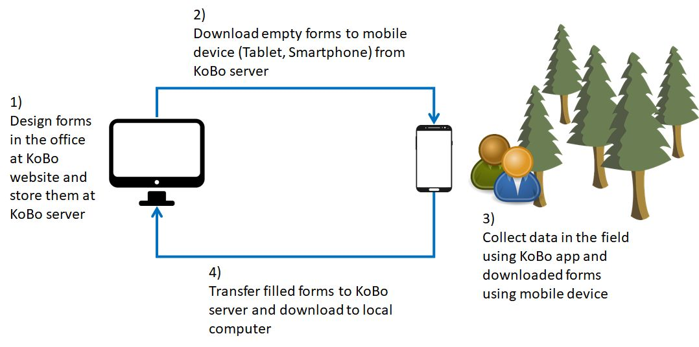

# Apps

## KoBo Toolbox

The  KoBo  Toolbox  is  a  collection  of  tools  for  field  data  collection  and  consist  of  a website (https://www.kobotoolbox.org), a server for data exchange and an Android app (https://play.google.com/store/apps/details?id=org.koboc.collect.android) for mobile devices like tablets and smartphones. It is an open-source initiative (https://github.com/kobotoolbox) and works on- and offline. For data transfer, SSL encryption is used. The basic procedure to use KoBo Toolbox for data collection consist of four basic steps:
  
  
1. Design of a form at the KoBo website  
2. Download empty form from KoBo server to mobile device running the KoBo Collet app  
3. Fill the form with measurement data in the field  
4. Upload filled forms to the KoBo server when data collection is finished and a internet connection is available  

###### Fig. 1: Basic concept for the use of the KoBo Toolbox for data collection 

---  
* [Back to index page](../index.md)
