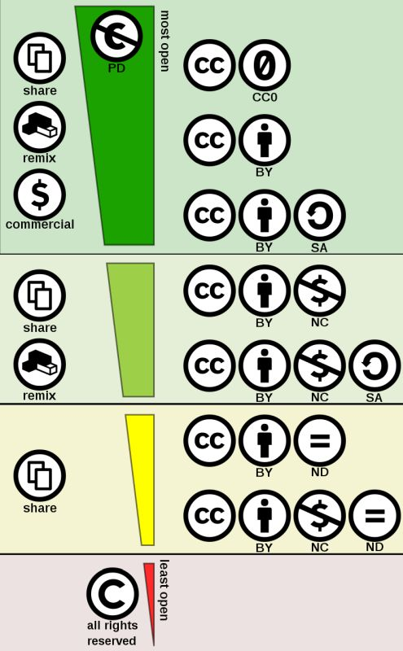

# Creative Commons Licenses

**Creative Commons (CC)** 

 Creative Commons is a US-american non-profit organization and international network aiming at publishing various standard licence agreements. With these licenses an author (creator of text, photos, paintings, drawings, technical sketches, video, music, software, data) can easily grant the public rights to use their works. These licences are not tailored to a single type of work, but are applicable to any work covered by copyright, for example texts, images, pieces of music, video clips, etc. 

This is how Free Content is created.

This illustration gives an overview of the different Creative Commons Licences:  

  

###### Fig. 1: Creative commons license spectrum (Source: <a href="https://en.wikipedia.org/wiki/Creative_Commons_license#/media/File:Creative_commons_license_spectrum.svg"> https://en.wikipedia.org/wiki/Creative_Commons_license#/media/File:Creative_commons_license_spectrum.svg</a>, License CC BY 4.0)  

Further information can be found at: <https://creativecommons.org/>

---  
* [Back to index page](../index.md)

