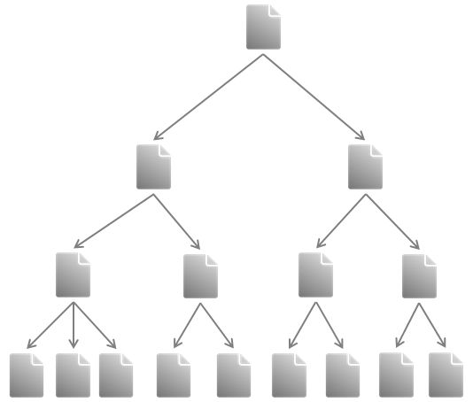

# Data Bases

The word data is the plural of the word datum and comes from Latin word “dare”, which stands for “(thing) given”. According to the Merriam-Webster dictionary, it describes factual information used as a basis for reasoning, discussion, or calculation (https://www.merriam-webster.com/dictionary/data).

In computer science, digital data are used. Data in this sense is any sequence of one or more symbols given meaning by specific act(s) of interpretation. A database in its broadest sense is an organized collection of data, stored and accessed electronically using a computer system (Gumm & Sommer 2009). The most important feature of a database is the fact that the data are stored in a persistent repository. This means that the data are still existent, even if the software to create or manage the database is closed.

The smallest unit of data is called a data item, e.g. first name, temperature. Groups of related data items are called records. A file can be understood as a collection of records of s single data type (Torey et al. 2011).

Database management systems (DBMS) are software solutions to manage databases and control access to data stored in a database. DBMS enable the definition of a database, manipulating, querying and updating the database (Rigaux et al. 2001).

The internal structure of a database is given by the database model. This database model defines how data are stored, organized and manipulated. There are several database models. The most common ones are the hierarchical and the relational database model (Kemper 2013).

The hierarchical database model is the oldest database model. Data are stored in a tree-structure (Fig. 1) as records, which are connected through links and form parent-child relationships. One record is defined as root node. Each other record exists as child record only once. Each child record has only one parent, but each parent record may have one or more child records. Thus, links are only possible from parent to child; links from child to parent are not possible. This is the big disadvantage of this database model. To retrieve data from the database, the whole tree needs to be passed starting with the root node.

  

###### Fig. 1:  Illustration of the hierarchical database model  

---  
* [Back to index page](../index.md)
