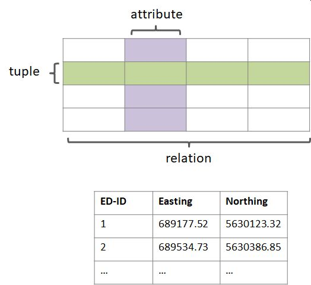
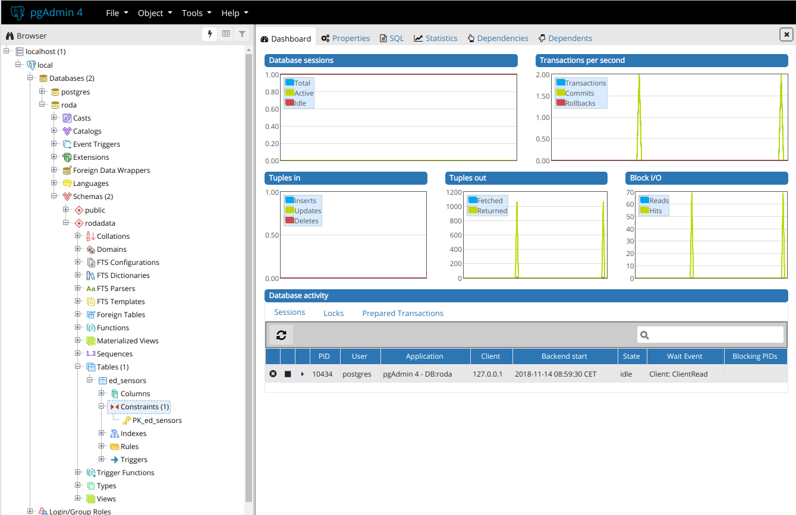
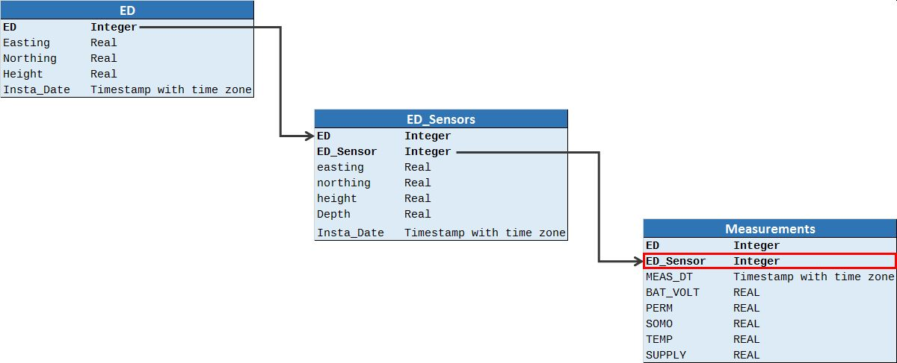
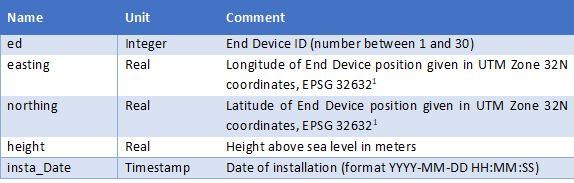
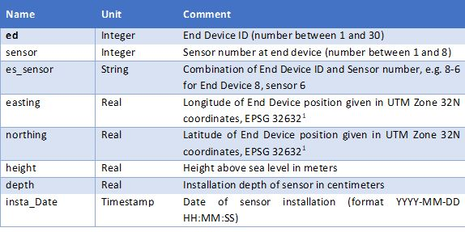

# Data Bases

<p align="justify">The word data is the plural of the word datum and comes from Latin word “dare”, which stands for “(thing) given”. According to the Merriam-Webster dictionary, it describes factual information used as a basis for reasoning, discussion, or calculation <a href="https://www.merriam-webster.com/dictionary/data" title="Title"> (https://www.merriam-webster.com/dictionary/data).</a> </p>

<p align="justify">In computer science, digital data are used. Data in this sense is any sequence of one or more symbols given meaning by specific act(s) of interpretation. A database in its broadest sense is an organized collection of data, stored and accessed electronically using a computer system (Gumm & Sommer 2009). The most important feature of a database is the fact that the data are stored in a persistent repository. This means that the data are still existent, even if the software to create or manage the database is closed.</p>

<p align="justify">The smallest unit of data is called a data item, e.g. first name, temperature. Groups of related data items are called records. A file can be understood as a collection of records of s single data type (Torey et al. 2011).</p>

<p align="justify">Database management systems (DBMS) are software solutions to manage databases and control access to data stored in a database. DBMS enable the definition of a database, manipulating, querying and updating the database (Rigaux et al. 2001).</p>

<p align="justify">The internal structure of a database is given by the database model. This database model defines how data are stored, organized and manipulated. There are several database models. The most common ones are the hierarchical and the relational database model (Kemper 2013).</p>

<p align="justify">The hierarchical database model is the oldest database model. Data are stored in a tree-structure (Fig. 1) as records, which are connected through links and form parent-child relationships. One record is defined as root node. Each other record exists as child record only once. Each child record has only one parent, but each parent record may have one or more child records. Thus, links are only possible from parent to child; links from child to parent are not possible. This is the big disadvantage of this database model. To retrieve data from the database, the whole tree needs to be passed starting with the root node.</p>

  

###### Fig. 1: Illustration of the hierarchical database model  

<p align="justify">Relational database models follow a different concept (Fig. 2). A relational database can be described as a collection of tables, which are also called relations. Such a table consists of rows (=tuples) and columns, which are also called attributes.</p>

<p align="justify">Each table needs to be unambiguously identifiable. Therefore each table contains one or more unique keys. A key must not be changed! 
For the definition of the database structure as well as for inserting, editing, deleting and querying data in a relational database, a domain-specific language for databases is used: SQL. This is the abbreviation for Structured Query Language.</p>

  

###### Fig. 2: Illustration of a relation in a relational database  

## 2.2.	PostgreSQL

<p align="justify">PostgreSQL is an object-relational database management system. It is maintained and developed by the PostgreSQL Global Development Group, a diverse group of many companies and individual contributors. It is free and open-source, released under the terms of the PostgreSQL License, a permissive software license. The initial release has been published in 1996 at the University of California at Berkeley Computer Science Department.</p>
<p align="justify">PostgreSQL is a SQL database on a server, which is accessed via a client (Fig. 3).</p> 

  

###### Fig. 3: PostgreSQL client-server  

<p alighn="justify">In the following, an example of how to install a PostgreSQL database is presented.,ase is installed on a local virtual machine.</p>

### Set up Use local VM

The following solution has been tested and implemented:  
1.	Download and install Oracel Virtual Box from: <https://www.virtualbox.org/wiki/Downloads>  
2.	Download an ISO file of a Linux distribution, e.g. Ubuntu 18.04 LTS from: <https://wiki.ubuntuusers.de/Downloads/>  
3.	Install Linux in Oracle Virtual Box  
4.	Start Linux in the Oracle Virtual Box  

### Setup of PostgreSQL data base “roda”

In the following, an example of a installation of a PostgreSQL database on a Linux system (KUbuntu, Ubuntu Linux using KDE Desktop environment) is shown. Instructions are taken from <a href="https://wiki.ubuntuusers.de/PostgreSQL/" title="Title"> https://wiki.ubuntuusers.de/PostgreSQL/.</a>

To install postgresql on Ubuntu use:

`sudo apt-get install postgresql-10`  

`sudo apt-get install postgresql-client`  

After this, the password of the superuser is set. The default name of the postgresSQL superuser is postgres. The superuser is the administrator of the PostgreSQL server. He has all priviliges and is able to create users.  

`sudo –u postgres psql`  

With this command, the postgresql command line mode is activated. To set the password for the superuser, enter the command:  

`\password postgres`  

Then the new password has to be entered twice. To quit the postgresql command line mode, enter:  

`\q`  

To create a new database user (e.g. anmed joe), the following command is used:  

`sudo –u postgres createuser –P –d joe`

Now the user "joe" can create a database called "roda":  

`sudo –u postgres createdb -O joe roda`  

### Administration of the database

<p align="justify">A PostgreSQL database can be managed either via entering commands in a terminal window or by using the graphical user interface offered by the software pgAdmin3 or via an internet browser when using pgAdmin4. For the current database “roda”, pgAdmin4 us used (Fig. 4).</p>  

  

###### Fig. 4: pgadmin4  

<p>To install pgadmin4, the following commands are required:</p>  

```
sudo sh -c 'echo "deb http://apt.postgresql.org/pub/repos/apt/ $(lsb_release -cs)-pgdg main" > /etc/apt/sources.list.d/pgdg.list'  
wget --quiet -O - https://www.postgresql.org/media/keys/ACCC4CF8.asc | sudo apt-key add -  
sudo apt-get update  
sudo apt-get install pgadmin4  
```

### Database scheme

<p align="justify">In the computer science, schemes are formal descriptions of data. A database scheme defines, which data are stored in which format in the database and which relations exists between the data. Tables containing the actual data are an object in a scheme.</p>  

<p align="justify">In PostgreSQL, there is a naming convention:</p>
  
- For SQL keywords, upper case letters are used  

- For names (=identifiers), lower case letters (with underscores) are used  

<p align="justify">Following this convention, the PostgreSQL server contains a database “roda”. This database contains two schemes, “public” and “rodadata”, whereas the scheme “rodadata” contains three tables: “ed”, “ed_sensors” and “measurements”. Each table needs to have a primary key. This key is printed in bold letters in Fig. 15, which illustrates the database scheme for the roda database.</p>  

  

###### Fig. 5: Database scheme  

<p>In the following, a more detailed description of the contents of the three tables is provided.</p>  

  

###### Fig. 6: Description of table “ed”  
  
  

###### Fig. 7: Description of table “ed_sensors”  

  
### Python and PostgreSQL

<p align="justify">To access the PostgreSQL database from Python, the python package “psycopg2 ” is used and can be installed using the Python package managing system pip via a terminal:</p>  

`pip install psycopg2`  

#### Connecting to data base using Python  

<p>The Python script “connect.py” shows, how to connect to the PostgreSQL data base “roda”.</p>

#!/usr/bin/env python
import psycopg2

```
try:
   conn = psycopg2.connect("dbname = 'roda' user='joe' password = '*****'")
   print("Connected to data base.")

except (Exception, psycopg2.DatabaseError) as error:
        print(error)
```
#### Create a table  

<p>The Python script "create_table_ed.py" creates a table called "ed" in the scheme "rodadata" with 5 columns.</p>  

```
#!/usr/bin/env python  
  
import sys  
import psycopg2  
  
try:  
    conn = psycopg2.connect(database="roda", user="carsten", password="*****")  
    print("Connected to data base.")  
  
except (Exception, psycopg2.DatabaseError) as error:  
        print(error)  
  
cur = conn.cursor()  
  
try:  
    cur.execute(  
        """CREATE TABLE rodadata.ed (  
                ed serial PRIMARY KEY,  
                easting real,  
                northing real,  
                height real,  
                inst_date date);  
                """)  
except (Exception, psycopg2.DatabaseError) as error:  
        print(error)  
  
conn.commit()  
conn.close()  
cur.close()  
  
```  

### Add data to table

<p align="justify">The Python script “add_data_to_table.py” reads a csv-file containing the data to be inserted line by line in a loop. The data will transferred to the table “ed” in the scheme “rodadata” of the database “roda”.  
The following Python script reads a CSV file (columns separated by semikolon) and inserts them into the table “ed“ in the scheme “rodadata”. By using %s placeholders, psycopg2 will do all conversions of data into their SQL representation automatically.</p>

```
#!/usr/bin/env python  
  
import csv  
import psycopg2  
  
try:  
    conn = psycopg2.connect(database="roda", user="joe", password="password")  
    print("Connected to data base.")  
  
except (Exception, psycopg2.DatabaseError) as error:  
        print(error)  
  
cur = conn.cursor()  
with open('user_accounts.csv', 'r') as f:  
    reader = csv.reader(f, delimiter=”;”)  
    next(reader)  # Skip the header row.  
    for row in reader:  
        cur.execute(  
            "INSERT INTO rodata.ed VALUES (%s, %s, %s, %s, %s)",  
            row  
        )  
conn.commit()  
  
conn.close()  
cur.close()  
  
 ```
 
 
        
        


## References

Kemper, A., & Eickler, A. (2013): Datenbanksysteme. Oldenbourg Wissenschaftsv.  

Gumm, H. P., & Sommer, M. (2009): Einführung in die Informatik. Oldenbourg Verlag.  

Rigaux, P., Scholl, M., & Voisard, A. (2001): Spatial databases: with application to GIS. Elsevier.  

Teorey, T. J., Lightstone, S. S., Nadeau, T., & Jagadish, H. V. (2011): Database modeling and design: Logical Design. Elsevier.  


---  
* [Back to index page](../index.md)
