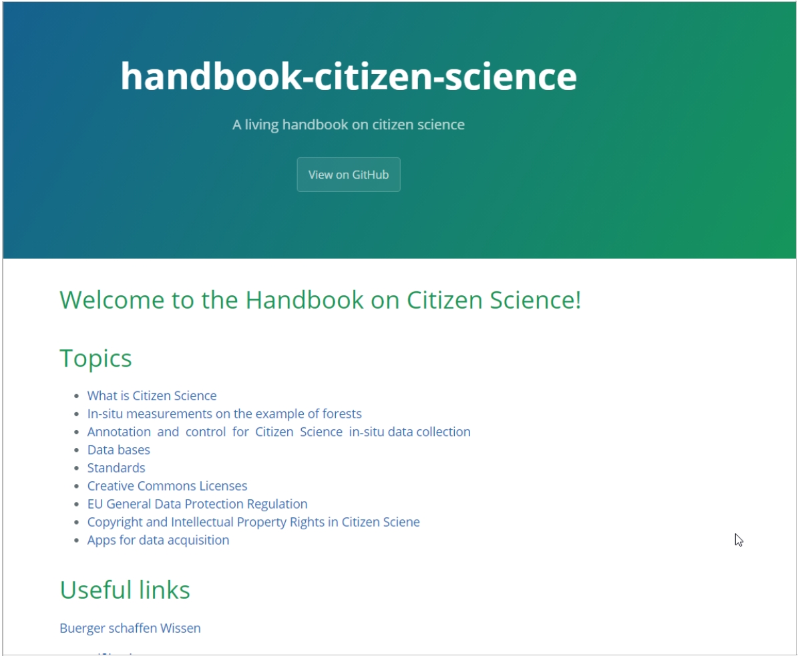
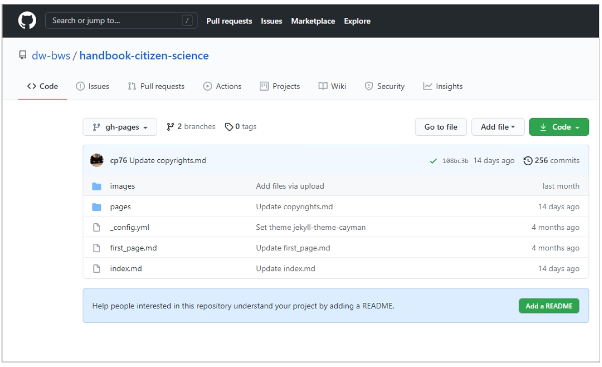
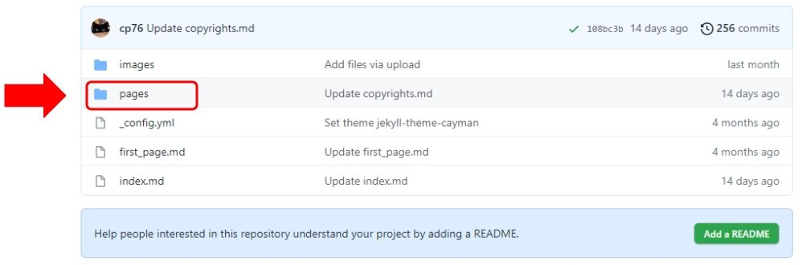
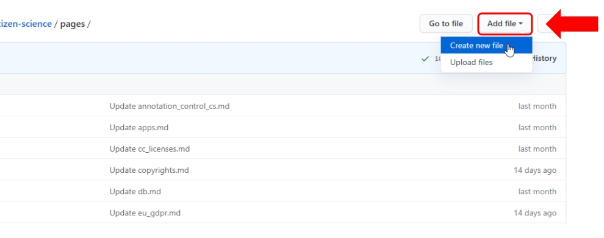
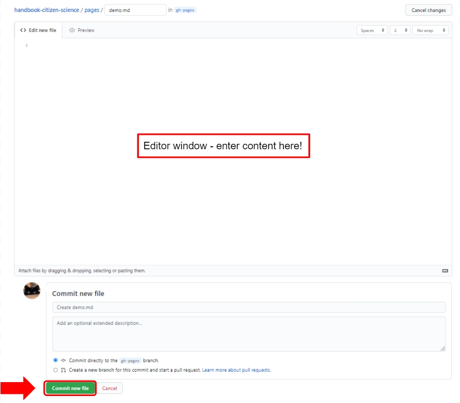
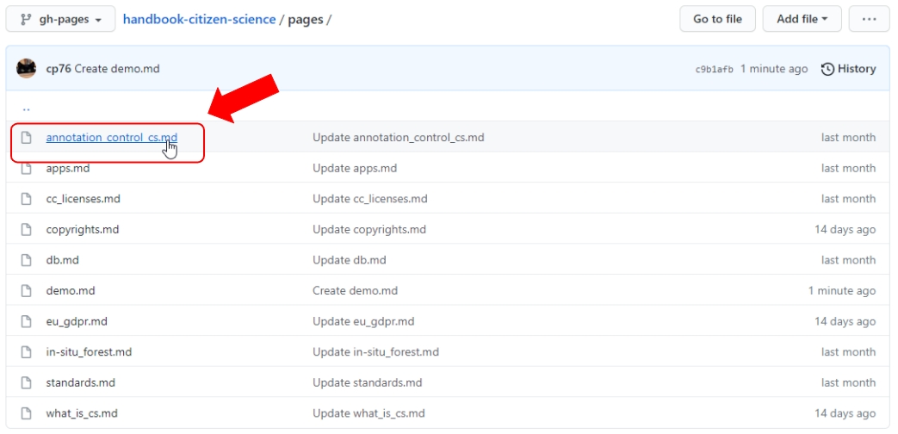

# How To work with GitHub pages and Markdown

The link to the DLR Citizen Science Wiki for users outside of DLR is: <a href="https://dw-bws.github.io/handbook-citizen-science/"> https://dw-bws.github.io/handbook-citizen-science/</a>  

###### Fig. 1: DLR Jena Citizen Science Wiki - Web View 

The link to the DLR Jena Citizen Science Wiki at Github pages is:<a href="https://github.com/dw-bws/handbook-citizen-science"> https://github.com/dw-bws/handbook-citizen-science</a>

###### Fig. 2: DLR Jena Citizen Science Wiki at Github pages

At the Github pages overview site, there are:  
1. One file “index.md”
- this file works as the home page,  
- when users are calling the external link, they call this file  
-
2. Two folders:  

- “images”
  - This folder contains all images used at the pages, stored in the folder “pages”.  
  
- "pages"  
  - This folder contains all pages with the content.
  - All files have the extension “.md”
  
## MD-Files

Files with the extension “.md” are plain ASCII files, where the extension stands for markdown. See also:  
<a href="https://en.wikipedia.org/wiki/Markdown">https://en.wikipedia.org/wiki/Markdown</a>  
<a href="https://daringfireball.net/projects/markdown/">https://daringfireball.net/projects/markdown/</a>  
  
There are different variants of the markdown syntax. Github is using the “GitHub Flavored Markdown”. The GitHub Flavored Markdown Specifications can be found here:  
<a href="https://github.github.com/gfm/">https://github.github.com/gfm/</a>
<a href="https://guides.github.com/features/mastering-markdown/">https://guides.github.com/features/mastering-markdown/</a>  
<a href="https://markdown-guide.readthedocs.io/en/latest/basics.html">https://markdown-guide.readthedocs.io/en/latest/basics.html</a>  

### Issues
The markdown syntax does sometimes not work for the version of the handbook that is accessible to external users at <a href="https://dw-bws.github.io/handbook-citizen-science/"> https://dw-bws.github.io/handbook-citizen-science/</a>

   **Example**  
   The markdown code for links. In this case, the official HTML syntax is required.  
   
   Markdown syntax:  
   `[GitHub Pages](https://pages.github.com/)`  
   
   HTML Syntax:  
   `<a href="https://pages.github.com/">GitHub Pages</a>`

## Create new page

At <a href="https://github.com/dw-bws/handbook-citizen-science">https://github.com/dw-bws/handbook-citizen-science</a> click at **“pages”** to enter the folder:  

###### Fig. 3: Enter the folder "pages"
  
In the folder **“pages”** select **“Create new file”** from dropdwon list **“Add file”**:  
   

###### Fig. 4: Enter the folder "pages"  
  
A new empty file will be opened. At the top, there is an entry field where you can enter the file name, e.g. “demo.md”  
  

###### Fig. 5: Specify file name    
  
Now enter content (text, images and markup commands) in the editor window  
  
To save the page, click on **“Commit new file”** at the bottom of the page.  

###### Fig. 6: Commit new file
  
## Edit existing page  
  
At <a href="https://github.com/dw-bws/handbook-citizen-science"> https://github.com/dw-bws/handbook-citizen-science</a> click at **“pages”** to enter the folder.  
In the folder, click at the file you want to edit:  
  

###### Fig. 7: Edit existing file  
  
-  

---  
* [Back to index page](../index.md)
