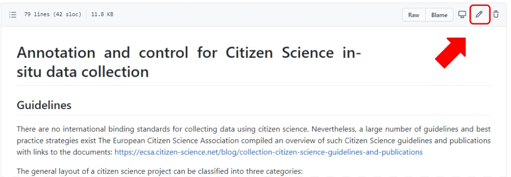
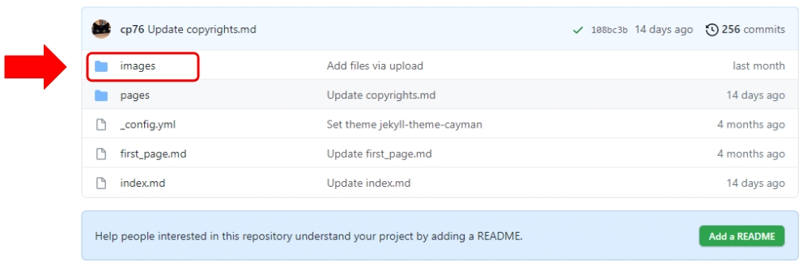
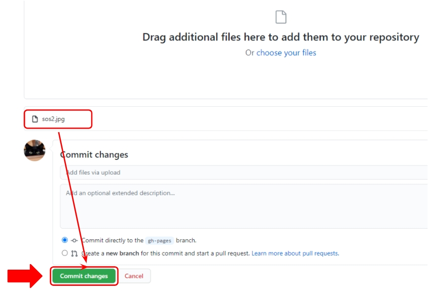

# How To work with GitHub pages and Markdown

The link to the DLR Citizen Science Wiki for users outside of DLR is: <a href="https://dw-bws.github.io/handbook-citizen-science/"> https://dw-bws.github.io/handbook-citizen-science/</a>  


###### Fig. 1: DLR Jena Citizen Science Wiki - Web View 

The link to the DLR Jena Citizen Science Wiki at Github pages is:<a href="https://github.com/dw-bws/handbook-citizen-science"> https://github.com/dw-bws/handbook-citizen-science</a>


###### Fig. 2: DLR Jena Citizen Science Wiki at Github pages

At the Github pages overview site, there are:  
1. One file “index.md”
- this file works as the home page,  
- when users are calling the external link, they call this file  
-
2. Two folders:  

- “images”
  - This folder contains all images used at the pages, stored in the folder “pages”.  
  
- "pages"  
  - This folder contains all pages with the content.
  - All files have the extension “.md”
  
## MD-Files

Files with the extension “.md” are plain ASCII files, where the extension stands for markdown. See also:  
<a href="https://en.wikipedia.org/wiki/Markdown">https://en.wikipedia.org/wiki/Markdown</a>  
<a href="https://daringfireball.net/projects/markdown/">https://daringfireball.net/projects/markdown/</a>  
  
There are different variants of the markdown syntax. Github is using the “GitHub Flavored Markdown”. The GitHub Flavored Markdown Specifications can be found here:  
<a href="https://github.github.com/gfm/">https://github.github.com/gfm/</a>
<a href="https://guides.github.com/features/mastering-markdown/">https://guides.github.com/features/mastering-markdown/</a>  
<a href="https://markdown-guide.readthedocs.io/en/latest/basics.html">https://markdown-guide.readthedocs.io/en/latest/basics.html</a>  

### Issues
The markdown syntax does sometimes not work for the version of the handbook that is accessible to external users at <a href="https://dw-bws.github.io/handbook-citizen-science/"> https://dw-bws.github.io/handbook-citizen-science/</a>

   **Example**  
   The markdown code for links. In this case, the official HTML syntax is required.  
   
   Markdown syntax:  
   `[GitHub Pages](https://pages.github.com/)`  
   
   HTML Syntax:  
   `<a href="https://pages.github.com/">GitHub Pages</a>`

## Create new page

At <a href="https://github.com/dw-bws/handbook-citizen-science">https://github.com/dw-bws/handbook-citizen-science</a> click at **“pages”** to enter the folder:  


###### Fig. 3: Enter the folder "pages"
  
In the folder **“pages”** select **“Create new file”** from dropdwon list **“Add file”**:  
   


###### Fig. 4: Enter the folder "pages"  
  
A new empty file will be opened. At the top, there is an entry field where you can enter the file name, e.g. “demo.md”  
  


###### Fig. 5: Specify file name    
  
Now enter content (text, images and markup commands) in the editor window  
  
To save the page, click on **“Commit new file”** at the bottom of the page.  


###### Fig. 6: Commit new file
  
## Edit existing page  
  
At <a href="https://github.com/dw-bws/handbook-citizen-science"> https://github.com/dw-bws/handbook-citizen-science</a> click at **“pages”** to enter the folder.  
In the folder, click at the file you want to edit:  
  


###### Fig. 7: Edit existing file  
  
The file will be opened and displayed in reading mode. To edit the file, click at the **pencil-icon** in the upper right corner:  
  


###### Fig. 8: Edit existing file - the pencil icon 
  
When editing is finished and you want to save the file, click at the button **“Commit changes”** below the editor window at the bottom of the page:  
  


###### Fig. 9: Commit edits
  
## Upload images
  
At <a href="https://github.com/dw-bws/handbook-citizen-science> https://github.com/dw-bws/handbook-citizen-science</a> click at **“images”** to enter the folder:
  


###### Fig. 10: Enter images folder
  
After you entered the folder, you can upload new images by dragging them from the Windows Explorer into the directory listing.  
When the image (e.g. sos2.jpg) has been uploaded to the folder, it has to be commited by clicking at the button **“Commit changes”**  
  


###### Fig. 11: Commit changes to images folder to finish image upload  
  
## Linking images
Assuming that the md-file is placed in the folder “pages”, you can insert images from the folder “images” using this syntax (image location, alternative text in case image can’t be displayed, how it is embedded in the text and image width to control the image size):  

``  
  
  
### Basic syntax  
  
#### Emphasis  
  
md-syntax  |  explanation
---------- |  --------------------------------------
`#`        |  headline; similar to `<h1>` tag in HMTL
`##`       |  headline; similar to `<h2>` tag in HMTL
`*text*`   |  *italic* text
`**text**` |  **bold** text
  
#### Unordered Lists  
  
Syntax:  
  
```* Item 1
* Item 2
  * Item 2a
  * Item 2b
```
  
Output:  
  
* Item 1
* Item 2
  * Item 2a
  * Item 2b
    
#### Ordered Lists  
  
Syntax:    
```1. Item 1
1. Item 2
1. Item 3
   1. Item 3a
   1. Item 3b
```
  
Output:  
  
1. Item 1
1. Item 2
1. Item 3
   1. Item 3a
   1. Item 3b  

  
#### Inline code

Syntax:  
```In Linux you can enter `df -h` to get an report of free disk space.```
  
Output:  
In Linux you can enter `df -h` to get an report of free disk space.

#### Code blocks  
  
Syntax:  
  
\```  
10 PRINT "Hello World";  
20 GOTO 10  
\```
  
Output:  
  
```
10 PRINT "Hello World";  
20 GOTO 10  
```  
  
### Backslash escapce  

Markdown allows you to use backslash escapes to generate literal characters which would otherwise have special meaning in Markdown’s formating syntax.  
Markdown provides backslash escapes for the following characters:  
  
\ backslash  
\` backtick  
\* asterisk  
\_ underscore  
\{} curly braces  
\[] square brackets  
\() parentheses  
\# hash mark  
\+ plus sign  
\- minus sign (hyphen)  
\. dot  
\! exclamation mark  
  
ende  


- 


---  
* [Back to index page](../index.md)
