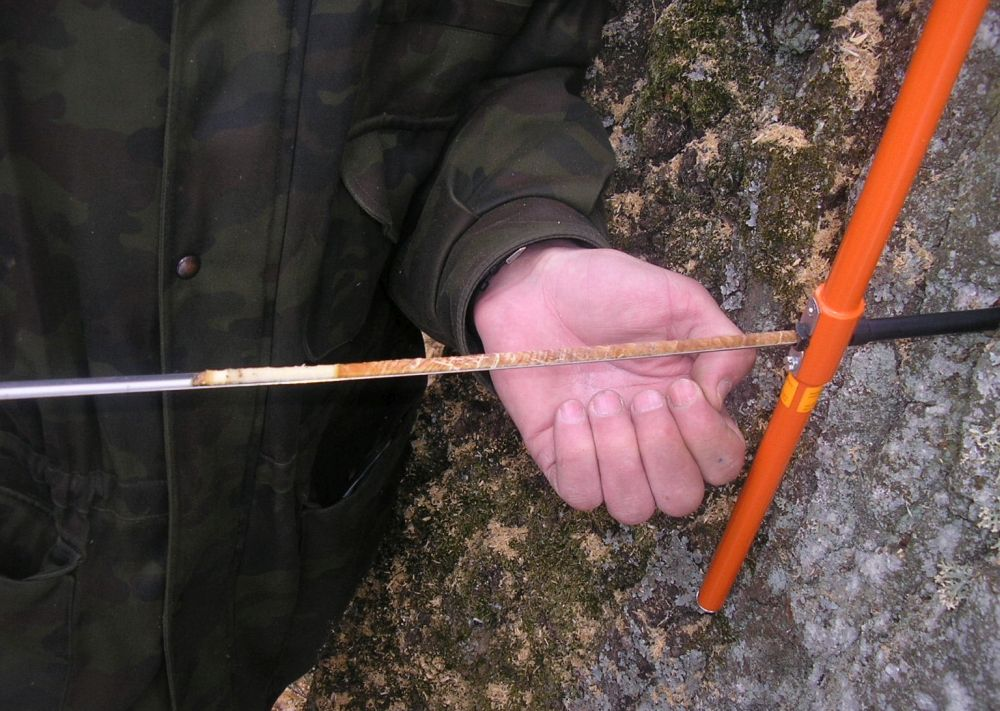
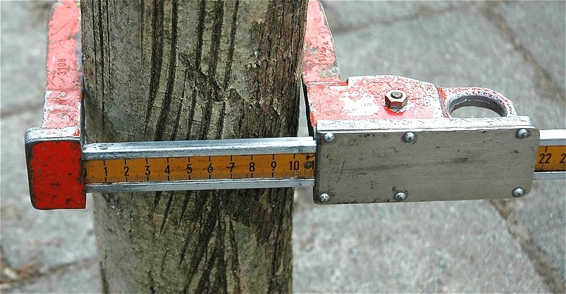

# In-situ measurements on the example of forests

## In-situ measurements:  

The phrase "in-situ" is a Latin phrase and means something like "on site" or "in position". When used as "in-situ measurement" it describes the way the measurement is obtained. specifically a geo- or biophysical phenomenon is measured in the same place the phenomenon is occurring without isolating it from other systems or altering the original conditions of the test.

## Individual Tree Parameters

### Age

Tree age is the time elapsed since the germination of the seed. It is important for assessing tree growth and yield. It can be measured by counting the tree or growth rings (see Fig.1).

###### Fig. 1: Tree rings (Source: https://upload.wikimedia.org/wikipedia/commons/4/42/Tree_rings.jpg, License CC BY‐SA 2.5)  

Tree rings may also be called annual ring as they correspond to every year of growth. But this is not completely true, as the formation of tree rings only occurs during the vegetation period, which may last four to five months depending on the latitude and local climatic conditions. Every year, a tree produces new cells, which are arranged in concentric circles around the centre of the tree. This ring shows the amount of wood produced during one growing season. Tree rings can typically be separated into early‐ and latewood. Earlywood is formed by large cells with thin walls at the beginning of the vegetation period, when growth is fast. This is the lighter part of an annual ring. When growth slows down usually at the end of the summer, small cells with thick walls form the latewood, which can be discerned as the darker part of an annual ring.

Tree rings can be counted after a tree has been felled. To count tree rings of living trees, a so called increment borer (Fig. 2) can be used. With this instrument, an increment core is extracted from the tree at breast height (please refer to next chapter for a definition of breast height). The tree rings contained in the core are counted. To this value, the estimated number of years is added to reach the height of the point of the core extraction (Van Laar and Akça 2007).

###### Fig. 2: Increment borer (Source: https://upload.wikimedia.org/wikipedia/commons/3/34/Pressler_drill_5_beentree.jpg, License CC BY‐SA 3.0)

### Tree Diameter  

In	forestry,	the	diameter	of	a	tree	stem	is	used	as	a	direct	measure	that,	together	with other	variables,	can	be	used	to	compute	cross‐sectional	areas,	surface	area	and	tree	volume	via	allometric	formulas.	The	diameter	is	typically	measure	at	breast	height	and	abbreviated	DBH	(diameter	at	breast	height	or	“BHD”	for	“Brusthöhendurchmesser”	in	German).	In	the	USA,	this	is	a	height	of	4.5	feet	above	ground.	In	countries	using	the	metric	system,	the	breast	height	is	measured	at 1.3	m	above	ground	level	(Husch	et	al.	2002).	Instruments	 commonly	 used	 in	 forestry	 to	 measure	 BHD	 are	 calipers	 (the	 German	name	for	the	instrument	is	“Kluppe”)	(Fig. 3) or	simple	measuring	tapes.
	

###### Fig. 3: Beam	caliper	(Source:	https://upload.wikimedia.org/wikipedia/commons/3/3b/Kluppeneinsatz.jpg, License	CC	BY‐SA	3.0)	

## References

Husch,	B.,	et	al.	(2002):	Forest	mensuration,	John	Wiley	&	Sons.  

Van Laar, A. and A. Akça (2007): Forest mensuration, Springer Science & Business Media.

