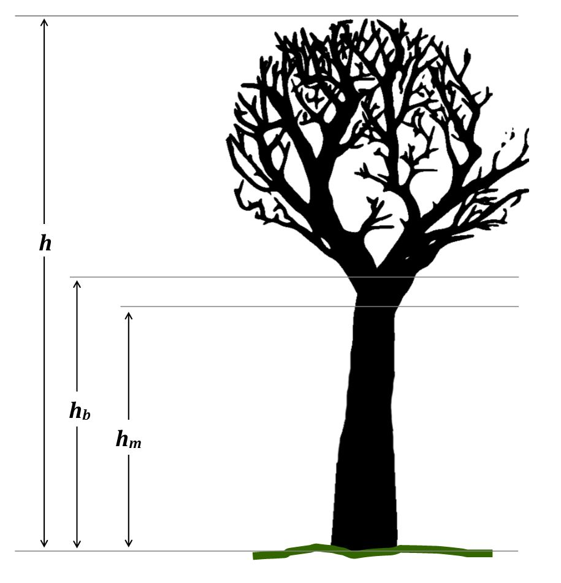

# In-situ measurements on the example of forests

## In-situ measurements:  

The phrase "in-situ" is a Latin phrase and means something like "on site" or "in position". When used as "in-situ measurement" it describes the way the measurement is obtained. specifically a geo- or biophysical phenomenon is measured in the same place the phenomenon is occurring without isolating it from other systems or altering the original conditions of the test.

## Individual Tree Parameters

### Age

Tree age is the time elapsed since the germination of the seed. It is important for assessing tree growth and yield. It can be measured by counting the tree or growth rings (see Fig.1).

###### Fig. 1: Tree rings (Source: https://upload.wikimedia.org/wikipedia/commons/4/42/Tree_rings.jpg, License CC BY‐SA 2.5)  

Tree rings may also be called annual ring as they correspond to every year of growth. But this is not completely true, as the formation of tree rings only occurs during the vegetation period, which may last four to five months depending on the latitude and local climatic conditions. Every year, a tree produces new cells, which are arranged in concentric circles around the centre of the tree. This ring shows the amount of wood produced during one growing season. Tree rings can typically be separated into early‐ and latewood. Earlywood is formed by large cells with thin walls at the beginning of the vegetation period, when growth is fast. This is the lighter part of an annual ring. When growth slows down usually at the end of the summer, small cells with thick walls form the latewood, which can be discerned as the darker part of an annual ring.

Tree rings can be counted after a tree has been felled. To count tree rings of living trees, a so called increment borer (Fig. 2) can be used. With this instrument, an increment core is extracted from the tree at breast height (please refer to next chapter for a definition of breast height). The tree rings contained in the core are counted. To this value, the estimated number of years is added to reach the height of the point of the core extraction (Van Laar and Akça 2007).

###### Fig. 2: Increment borer (Source: https://upload.wikimedia.org/wikipedia/commons/3/34/Pressler_drill_5_beentree.jpg, License CC BY‐SA 3.0)

### Tree Diameter  

In forestry, the diameter of a tree stem is used as a direct measure that, together with other variables, can be used to compute cross‐sectional areas, surface area and tree volume via allometric formulas. The diameter is typically measure at breast height and abbreviated DBH (diameter at breast height or “BHD” for “Brusthöhendurchmesser” in German). In the USA, this is a height of 4.5 feet above ground. In countries using the metric system, the breast height is measured at 1.3 m above ground level (Husch et al. 2002). Instruments  commonly  used  in  forestry  to  measure  BHD  are  calipers  (the  German name for the instrument is “Kluppe”) (Fig. 3) or simple measuring tapes.
 

###### Fig. 3: Beam caliper (Source: https://upload.wikimedia.org/wikipedia/commons/3/3b/Kluppeneinsatz.jpg, License CC BY‐SA 3.0) 

### Height 

 Tree height is the most important vertical distance measure, but it is an ambiguous term, if not clearly defined. Total tree height <em>h</em> is defined as the vertical distance along the axis of the tree between the tree top and the ground. The bole height <em>hb</em>  is defined as the vertical distance along the axis of the tree between the crown point and the ground. The crown point is the point, where the first crown‐forming branch is located. The merchantable height <em>hm</em> is defined as the vertical distance along the axis of the tree between the terminal position of the last usable position of the stem and the ground. An illustration of these height variables can be found in Fig. 4.
 
 

###### Fig. 4:  Different tree height variables (Source: https://openclipart.org/ images released into Public Domain; own editing) 

Depending on the tree height, different instruments can be used to these this variables. Short trees can be measured using a simple levelling rod. For taller trees,a hypsometer can be used. This instrument is using either using geometric functions (hypsometer based  on  similar  triangles)  or  trigonometric  (hypsometers  based  on  tangents  and angles) functions to determine the height of a tree (Husch et al. 2002).

 
 
## Stand Parameters 
### Species Composition 

 The species composition describes, which tree species can be found in a forest stand. A forest  stand  may  contain  only  one  dominant  or  different  tree  species.  Forest management  and  certification  protocols  require  the  documentation  of  the  species composition of a forest stand.

### Age 

Natural  forests  usually  are  characterized  by  trees  of  different  ages  within  an administrative unit (e.g. forest stand). In managed forests, trees in a forest stand can be even‐aged or uneven‐aged. Trees in an even‐aged forest stand belong to one age class originating at the same time and usually show similar sizes (heights, diameters). 
An uneven‐aged  stand  consist  of  trees  that  originate  at  different  times  and consequently, the trees of the different age classes show different sizes, which typically results in several storeys. 
Usually, managed forests are well documented in management plans. Thus the age of an even‐aged or uneven‐aged stand can becalculated from the time elapsed between the documented date of the germination of the seeds and the current date. 
If this not the case, the measurement methods described above for the indvidual tree parameter "age" can be used to get data from a appropriate sample of the trees within a forest stand to derive the age class of the forest stand. 
If forest stands consists of an upper storey of even‐aged trees, and a similarly even‐aged but younger lower storey, the two age classes might be weighted, for example, by assigning a weight to each age class proportional to volume (Anuchin 1970). If the stand  consists  of  several  identifiable  clusters  of  even‐aged  trees,  weights  might  be assigned proportional to the area occupied by these clusters (Kramer and Dong 1985).
 

### Height 

Tree height is required for determining the timber stock of a forest stand. Tree height in  forest  stands  with  an  even‐aged  population  may  vary  less  than  in  uneven‐aged stands. Also the variation in diameter in an even‐aged stand is usually less than in an uneven‐aged  stand,  where  the  height  distribution  is  often  similar  to  the  diameter distribution (Husch et al. 2002).
 
 
 
### Diameter 

The diameter, typically the diameter at breast height (DBH) is regarded as the most important stand parameter. Together with data on tree age and height it can be used to calculate the timber stock, either expressed a volume (cubic metres or soil cubic metres). Data on diameter are collected during forest inventory using the methods described above for the indvidual tree parameter "diamter".

### Stand Density 

Stand density refers either to the degree to which a forest plot is populated by trees or how much wood or biomass can found at a certain area.  
Stand  density  is  a  quantitative  measure  describing  tree  cover  on  area,  e.g.  a  forest stand. It can be expressed in terms of biomass, crown closure, number of trees, basal area, volume, or weight. 
In the Free State of Thuringia, stand density refers to the crown closure as a percentage and is categorized into six classes ranging from unstocked (crown closure <10%) to very dense (crown closure >90%). The crown closure of a forest stand is defined as the area of the crown,projected on a horizontal plane, relative to the total ground area of these trees.

 
### Volume and Weight 

 Estimating  the  volume  and  weight  of  the  trees  of  a  forest  stand  is  an  important information  for  forest  management.  Usually,  these  parameters  are  determined  by selecting  an  appropriate  sample  of  representative  trees  within  a  forest  stand  and collect single tree parameters such as tree height, diameter at breast height, species and  age.  Based  on  these  data,  the  volume  and  thus  the  weight  of  the  trees  can  be determined by using allometric formulas. Forest related allometry is concerned with study of the relation between size, volume and shape of trees. As a result of this field of research, allometric equations have been derived which give the possibility to calculate the volume and weight of a tree based on a few single tree parameters. 
When the volume and weight of a representative sample of trees of a forest stand are known, the overall volume and weight of the trees within the stand under observation can be calculated via the number of trees within the forest stand. 
This procedure is very efficient in even aged stands with one species. For uneven‐aged stands and/or stand with multiple tree species, this is more complicated. Then the trees in the forest stands need to be stratified to be able to apply the procedure for each strata individually. 
Another possibility for estimating the volume and weight of the trees of a whole forest stand is the use of yield tables, which have been used since the 19 th  century. They are based  on  empirical  knowledge  and  list  the  potential  timber  yield  for  specific  tree species in specific bio‐geographical regions for different age and height classes. Using yield tables usually assumes even‐aged stands with one dominant species.

 
 
## References

Husch, B., et al. (2002): Forest mensuration, John Wiley & Sons.  

Van Laar, A. and A. Akça (2007): Forest mensuration, Springer Science & Business Media.

