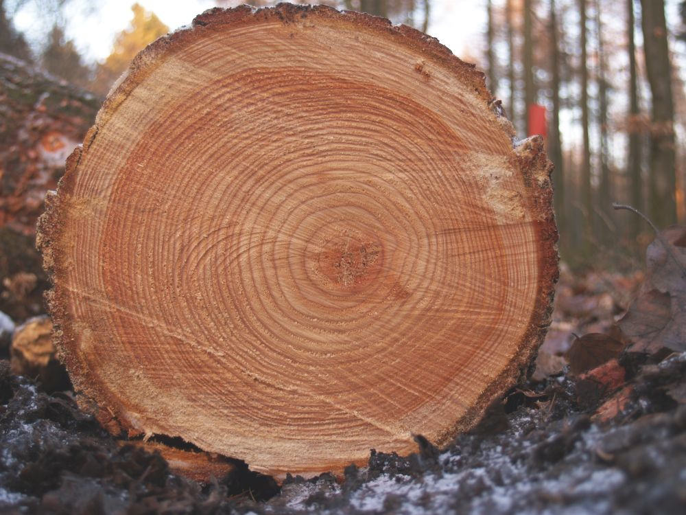

# In-situ measurements on the example of forests

## In-situ measurements:  
The phrase "in-situ" is a Latin phrase and means something like "on site" or "in position". When used as "in-situ measurement" it describes the way the measurement is obtained. specifically a geo- or biophysical phenomenon is measured in the same place the phenomenon is occurring without isolating it from other systems or altering the original conditions of the test.

## Individual Tree Parameters

### Age

Tree age is the time elapsed since the germination of the seed. It is important for assessing tree growth and yield. It can be measured by counting the tree or growth rings (see Fig.1).

###### Fig. 1: Tree rings (Source: https://upload.wikimedia.org/wikipedia/commons/4/42/Tree_rings.jpg, License CC BY‐SA 2.5)  

Tree rings may also be called annual ring as they correspond to every year of growth. But this is not completely true, as the formation of tree rings only occurs during the vegetation period, which may last four to five months depending on the latitude and local climatic conditions. Every year, a tree produces new cells, which are arranged in concentric circles around the centre of the tree. This ring shows the amount of wood produced during one growing season. Tree rings can typically be separated into early‐ and latewood. Earlywood is formed by large cells with thin walls at the beginning of the vegetation period, when growth is fast. This is the lighter part of an annual ring. When growth slows down usually at the end of the summer, small cells with thick walls form the latewood, which can be discerned as the darker part of an annual ring.
