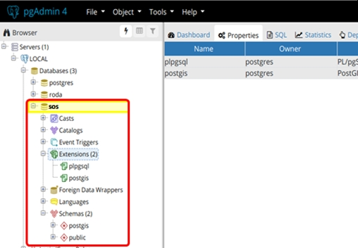

# Standards for automated Data Collection
  
<p align="justify">Generally speaking, a standard is something established by an authority, a custom, or by general consent as a model or as an example.
Standards in computer science define conventions and procedures by broadly recognized bodies (e.g. standards organizations). They exist for operating systems, programming languages, data formats, communications protocols and electronic interfaces<sup>1</sup>. Standards help to build solutions (e.g. software) that works on different computers. They are usually available as printed or electronic public documents in the internet or libraries.</p>

<sup>1</sup> <a href="https://www.webopedia.com/TERM/S/standard.html"> https://www.webopedia.com/TERM/S/standard.html</a>

## OGC
<p align="justify">The abbreviation OGC stands for Open Geospatial Consortium. It is a international voluntary standards organization, formed in 1994. In the OGC more than 500 members are working together on a consensus process for the development and implementation of open standards for geospatial data and services.
Among the standards of the OGC are WMS (Web Map Services), WFS (Web Feature Service), KML (Keyhole Markup Language) or SOS (Sensor Observation Service).</p>

## SOS
### Overview

<p align="justify">The abbreviation SOS means Sensor Observation Service. It is a standard first defined by the OGC in 2007. The main objective of the SOS is to provide a possibility for accessing observations (or measurements) from sensors in a standardized and consistent way. Sensor systems may include in-situ, remote-sensing, fixed or mobile sensors. This is realized by providing an API (Application Programming Interface) for managing the connected sensors and retrieving the measurement data collected by the sensors.
The SOS acts like an intermediary between a client and a physical sensor device or an repository containing measurements (Fig. 1). SOS can also be understood as a web service in this context may be defined as a service offered by an electronic device (e.g. computer) to one another electronic device, which communicating with each other via the World Wide Web of the internet.</p>
                 


###### Fig. 1: Illustration of SOS as intermediary between a sensor system and a client
  
<p align="justify">The sensor data consist of a description of the sensors themselves realized using the Sensor Model Language (SensorML) and the actual measured values given in the Observations and Measurements (O&M) encoding format.  
The SOS consist of three core operations that must be provided by each implementation:</p>

1. GetCapabilities
- to query a service for a description of the service interface and the available sensor data
2. GetObservation: 
- to retrieve data for specific sensors
- measured values and their metadata is returned in the Observations and Measurements encoding format (O & M).
3. DescribeSensor:
- to return detailed information about a sensor or a sensor system
- uses the Sensor Model Language (SensorML)

Besides the three core operations, there are also “Transactional operations” and “Extended operations”.

More information about the OGC SOS standard can be found at:  
<a href="https://www.opengeospatial.org/standards/sos"> https://www.opengeospatial.org/standards/sos</a>

A detailed description of the SOS can be downloaded from here:  
<a href="https://portal.opengeospatial.org/files/?artifact_id=47599"> https://portal.opengeospatial.org/files/?artifact_id=47599 </a>

More information about the SensorML is provided at this website:  
<a href="https://www.opengeospatial.org/standards/sensorml"> https://www.opengeospatial.org/standards/sensorml</a>

The documentation for the SensorML can be retrieved following this link:  
<a href="https://portal.opengeospatial.org/files/?artifact_id=55939"> https://portal.opengeospatial.org/files/?artifact_id=55939</a>

Inforamtion about O&M are available here:  
<a href="https://www.opengeospatial.org/standards/om"> https://www.opengeospatial.org/standards/om</a>

The documentation for the O&M encoding system can be found here:  
<a href="http://portal.opengeospatial.org/files/?artifact_id=41510"> http://portal.opengeospatial.org/files/?artifact_id=41510 </a>

###	Example implementation with “istSOS”  

istSOS is an OGC SOS server implementation realized in the  Python language istSOS and is released under the GPL v2 l. It allows for managing and transmitting observations from sensors according to the OGC-SOS standard. istSOS comes with a Graphical User Interface for administration.

The project website is: <a href="http://istsos.org/"> http://istsos.org/ </a>

In the following, the installation of istSOS is described using the instructions provided here:  
<a href="http://istsos.org/en/latest/doc/installation.html"> http://istsos.org/en/latest/doc/installation.html</a>

Assuming that an installation of PostgreSQL database server exists and is running, the SOS implementation requires an Apache web server. The module “mod-wsgi” will enable the execution of Python scripts by the Apache-HTTP-Server.
```
sudo apt-get install apache2 libapache2-mod-wsgi
```
If not already done, psycopg2, a PostgreSQL adapter for Python is installed:  
```
sudo apt-get install python-psycopg2
```
Then the istSOS is downloaded from:  
<a href="https://sourceforge.net/projects/istsos/files/latest/download?source=files">https://sourceforge.net/projects/istsos/files/latest/download?source=files</a>

and will be extracted to /usr/local/:  
```
sudo tar -zxvf istSOS-2.1.1.tar.gz -C /usr/local/
```
Then, some permission need to be changed:  
```
sudo chmod 755 -R /usr/local/istsos
sudo chown -R www-data:www-data /usr/local/istsos/services
sudo chown -R www-data:www-data /usr/local/istsos/logs
sudo chown -R www-data:www-data /usr/local/istsos/wns
```

Now Apache and WSGI are configured:  
```
sudo vi /etc/apache2/sites-enabled/000-default.conf
```

These lines are added just before the last VirtualHost tag:  

```
#ServerName www.example.com
ServerAdmin webmaster@localhost
DocumentRoot /var/www/html

ErrorLog ${APACHE_LOG_DIR}/error.log
CustomLog ${APACHE_LOG_DIR}/access.log combined

WSGIScriptAlias /istsos /usr/local/istsos/application.py
Alias /istsos/admin /usr/local/istsos/interface/admin
Alias /istsos/modules /usr/local/istsos/interface/modules

<LocationMatch /istsos>
  Options +Indexes +FollowSymLinks +MultiViews
  AllowOverride all
  Require all granted
</LocationMatch>
```

Now the Apache server is restarted:  
```
sudo service apache2 restart
```
Finally, a PostGIS database “istsos” is created:  
```
sudo -u postgres createdb -E UTF8 istsos
sudo -u postgres psql -d istsos -c 'CREATE EXTENSION postgis'
```

### Example implementation with “52°North”  

A reference implementation of the OGC SOS specification has been published by 52°North (https://52north.org/). It is an interoperable interface for publishing and querying sensor data and metadata.  

The installation guide can be found here:  
<a href="https://wiki.52north.org/SensorWeb/SensorObservationServiceIVDocumentation#Installation">https://wiki.52north.org/SensorWeb/SensorObservationServiceIVDocumentation#Installation</a>  

#### Installation requirements  

-	Java Runtime environment (JRE) or Java Development Kit (JDK)
-	Apache Tomcat Open-Source Webserver and –container
-	A running DBMS, in this case the previously installed PostgreSQL database system

1)	Create database „sos“ in PostgreSQL using pgadmin4  
Use pgadmin 3 or 4 to create a postgresql database called “sos” (Fig. 2).



###### Fig. 2: Databse “sos” in pgadmin 4

2)	Install postgis  

To install the postgis extension for postgresql, the following guide was used:  
<a href="https://freegistutorial.com/how-to-install-postgis-on-ubuntu-18-04/">https://freegistutorial.com/how-to-install-postgis-on-ubuntu-18-04/</a>

To install postgis:  
```
sudo apt install postgis
```

Now switch user to superuser:  
```
sudo su
```
And start postgresql as superuser:  
```
su -  postgres
```
At the postgresql prompt, connect to the database “sos”:  

```
postgres=# \connect sos
```

Create a schema called postgis:  
```
sos=# CREATE SCHEMA postgis;
sos=# ALTER DATABASE sos SET search_path=public, postgis, contrib;
```

Create an postgis extension:  
```
sos=#  CREATE EXTENSION postgis SCHEMA postgis;
sos=# SELECT postgis_full_version();
```

An extension can also be installed using the Graphical User Interface pgadmin4.

3)	Install Apache Tomcat  

Instructions are taken from:  
<a href="https://websiteforstudents.com/tomcat-9-0-12-released-heres-how-to-install-upgrade-on-ubuntu-16-04-18-04-lts/">https://websiteforstudents.com/tomcat-9-0-12-released-heres-how-to-install-upgrade-on-ubuntu-16-04-18-04-lts/</a>

a)	Install Java
```
sudo su
sudo add-apt-repository ppa:webupd8team/java
sudo apt update
sudo apt install oracle-java8-installer
sudo apt install oracle-java8-set-default
```
Now that JAVA is installed, run the commands below to set its home directory. Use the editor “Nano” to edit the file “environment” in the directory /etc of the inux installation:  
```
sudo nano /etc/environment
```
Then copy and paste the follwoing lines below and save the file:  
```
PATH="/usr/local/sbin:/usr/local/bin:/usr/sbin:/usr/bin:/sbin:/bin:/usr/games:/usr/local/games"
JAVA_HOME=/usr/lib/jvm/java-8-oracle
export JAVA_HOME
```

To apply the changes to the current instance of the shell enter:
```
source /etc/environment
```

b)	Download and install Tomcat Packages  

This downloads the zipped tomcat package files to the /tmp directory of the Linux installation:  
```
cd /tmp && wget http://mirrors.sonic.net/apache/tomcat/tomcat-9/v9.0.12/bin/apache-tomcat-9.0.12.tar.gz
```

Unpack the zip-file:  
```
tar -xzf apache-tomcat-9.0.12.tar.gz
```
Move it to the directory /opt/tomcat9 of the Linux installation:  
```
sudo mv apache-tomcat-9.0.12 /opt/tomcat9
```

Create a user called “tomcat9”:  
```
sudo useradd -r tomcat9 --shell /bin/false
sudo chown -R tomcat9 /opt/tomcat9
```

c)	Configure Tomcat9 Service  
```
sudo gedit /opt/tomcat9/conf/tomcat-users.xml
```

Then create an account with password for the user and save by copying and pasting the line below into the file just before the </tomcat-users>:  

```
<role rolename="manager-gui"/>
<role rolename="admin-gui"/>
<user username="admin" password="password_here" roles="manager-gui,admin-gui"/>
```

Then edit the file “tomcat.service” using gedit:  
```
sudo gedit /etc/systemd/system/tomcat.service
```

And the following content:
```
[Unit]
Description=Tomcat9
After=network.target
[Service]
Type=forking
User=tomcat9
Group=tomcat9
Environment=CATALINA_PID=/opt/tomcat9/tomcat9.pid
Environment=JAVA_HOME=/usr/lib/jvm/java-8-oracle/
Environment=CATALINA_HOME=/opt/tomcat9
Environment=CATALINA_BASE=/opt/tomcat9
Environment="CATALINA_OPTS=-Xms512m -Xmx512m"
Environment="JAVA_OPTS=-Dfile.encoding=UTF-8 -Dnet.sf.ehcache.skipUpdateCheck=true -XX:+UseConcMarkSweepGC -XX:+CMSClassUnloadingEnabled -XX:+UseParNewGC"
ExecStart=/opt/tomcat9/bin/startup.sh
ExecStop=/opt/tomcat9/bin/shutdown.sh
[Install]
WantedBy=multi-user.target
```

After doing this, run the following commands:  
```
sudo systemctl daemon-reload
sudo systemctl start tomcat.service
sudo systemctl restart tomcat.service
sudo systemctl enable tomcat.service
```
d)	Configure Tomcat Web Management Interface  

<a href="https://linuxize.com/post/how-to-install-tomcat-8-5-on-ubuntu-18.04/">https://linuxize.com/post/how-to-install-tomcat-8-5-on-ubuntu-18.04/</a>

If you need to access the web interface from anywhere, open the following files and comment or remove the bold lines highlighted in yellow:  
```
gedit /opt/tomcat9/webapps/manager/META-INF/context.xml
```

Comment out (with '<!--  things to comment out  -->'):  
```
<Context antiResourceLocking="false" privileged="true" >
**
<!--
  <Valve className="org.apache.catalina.valves.RemoteAddrValve"
         allow="127\.\d+\.\d+\.\d+|::1|0:0:0:0:0:0:0:1" />
-->**

</Context>

And then do the same for:
gedit /opt/tomcat9/webapps/host-manager/META-INF/context.xml
Comment out (with <!--  things to comment out -->):

<Context antiResourceLocking="false" privileged="true" >
<!--
  <Valve className="org.apache.catalina.valves.RemoteAddrValve"
         allow="127\.\d+\.\d+\.\d+|::1|0:0:0:0:0:0:0:1" />
-->
</Context>
```

Finally restart tomcat:  
```
sudo systemctl restart tomcat
```


---  
* [Back to index page](../index.md)
