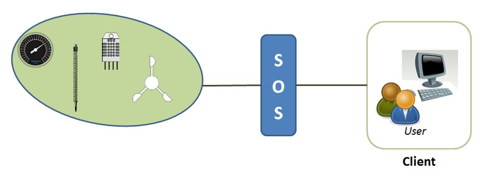

# Standards for automated Data Collection
  

Generally speaking, a standard is something established by an authority, a custom, or by general consent as a model or as an example.
Standards in computer science define conventions and procedures by broadly recognized bodies (e.g. standards organizations). They exist for operating systems, programming languages, data formats, communications protocols and electronic interfaces1. Standards help to build solutions (e.g. software) that works on different computers. They are usually available as printed or electronic public documents in the internet or libraries.

1 <a href="https://www.webopedia.com/TERM/S/standard.html"> https://www.webopedia.com/TERM/S/standard.html</a>

## OGC

The abbreviation OGC stands for Open Geospatial Consortium. It is a international voluntary standards organization, formed in 1994. In the OGC more than 500 members are working together on a consensus process for the development and implementation of open standards for geospatial data and services.
Among the standards of the OGC are WMS (Web Map Services), WFS (Web Feature Service), KML (Keyhole Markup Language) or SOS (Sensor Observation Service).

## SOS
# Overview

The abbreviation SOS means Sensor Observation Service. It is a standard first defined by the OGC in 2007. The main objective of the SOS is to provide a possibility for accessing observations (or measurements) from sensors in a standardized and consistent way. Sensor systems may include in-situ, remote-sensing, fixed or mobile sensors. This is realized by providing an API (Application Programming Interface) for managing the connected sensors and retrieving the measurement data collected by the sensors.
The SOS acts like an intermediary between a client and a physical sensor device or an repository containing measurements (Fig. 16). SOS can also be understood as a web service in this context may be defined as a service offered by an electronic device (e.g. computer) to one another electronic device, which communicating with each other via the World Wide Web of the internet.

                 

The sensor data consist of a description of the sensors themselves realized using the Sensor Model Language (SensorML) and the actual measured values given in the Observations and Measurements (O&M) encoding format.  
The SOS consist of three core operations that must be provided by each implementation:

---  
* [Back to index page](../index.md)
